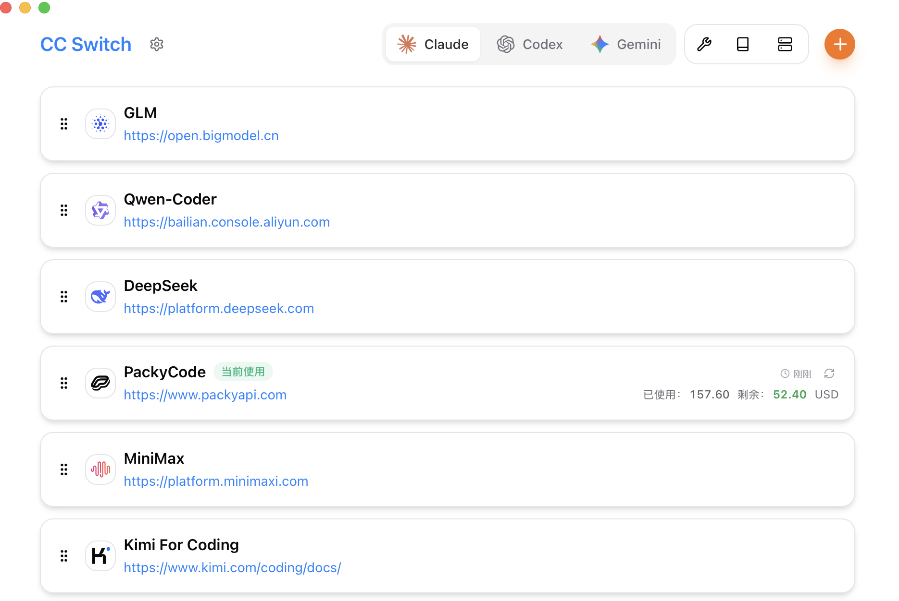
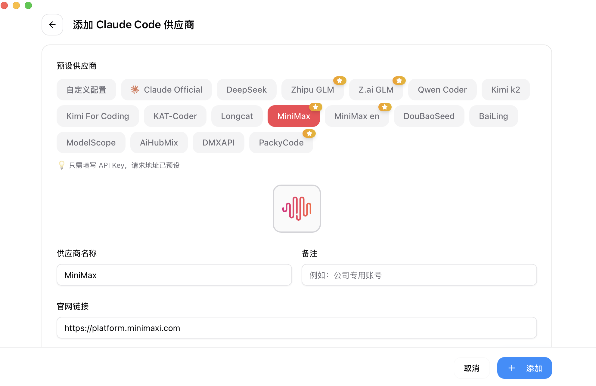

<div align="center">

# Claw Switch

### AI 编程工具的统一管理平台

[](https://github.com/heimanba/claw-switch/releases)
[](https://github.com/heimanba/claw-switch/releases)
[](https://tauri.app/)
[](https://github.com/heimanba/claw-switch/releases/latest)

**一站式管理 Claude Code、Codex、Gemini CLI、OpenCode 和 OpenClaw**

[English](docs/README-en.md) | 简体中文

</div>

---

## 核心能力

### 🚀 OpenClaw 深度集成

OpenClaw 是新一代 AI 编程网关，Claw Switch 为其提供完整的可视化管理：

- **多渠道消息网关** — 支持 Telegram、Discord、Slack、飞书、钉钉、微信、WhatsApp、iMessage 等 8+ 消息渠道
- **智能 Agent 配置** — 可视化配置 Agent 默认模型、回退策略、上下文压缩、并发控制
- **供应商热切换** — 50+ 预设供应商，支持 Coding Plan、百炼、DeepSeek、Kimi、GLM 等国产模型
- **实时诊断系统** — 一键检测环境依赖、配置验证、网关健康、频道状态，支持自动修复
- **工作区编辑器** — 直接编辑 AGENTS.md、SOUL.md 等 Agent 配置文件

### 📋 Coding Plan 原生支持

阿里云 Coding Plan 是面向开发者的 AI 编程服务，Claw Switch 提供一流的集成体验：

- **一键配置** — 预设国内/国际区域端点，自动填充模型列表
- **多协议支持** — OpenAI Completions、Anthropic Messages 协议自动切换
- **模型目录** — 内置 Qwen 3.5 Plus、Qwen 3 Coder、GLM-5、MiniMax M2.5、Kimi K2.5 等热门模型
- **跨工具同步** — 一份 Coding Plan 配置同步到 Claude Code、OpenCode、OpenClaw

### 🔧 五大 AI 编程工具统一管理

| 工具 | 配置格式 | 支持功能 |
|------|---------|---------|
| **Claude Code** | JSON | 供应商切换、MCP、Prompts、Skills、会话管理 |
| **Codex** | JSON | 供应商切换、多账号管理 |
| **Gemini CLI** | TOML | 供应商切换、Prompts 同步 |
| **OpenCode** | TOML | 供应商切换、MCP、通用供应商 |
| **OpenClaw** | YAML | 完整网关管理、Agent 配置、渠道管理 |

---

## 界面预览

|                  主界面                   |                  添加供应商                  |
| :---------------------------------------: | :------------------------------------------: |
|  |  |

---

## 功能特性

### 供应商管理
- **50+ 预设供应商** — Coding Plan、百炼、DeepSeek、Kimi、GLM、MiniMax、OpenRouter、AWS Bedrock 等
- **通用供应商** — 一份配置同步到 OpenCode 和 OpenClaw
- **系统托盘快速切换** — 无需打开应用即可切换供应商
- **拖拽排序** — 自定义供应商显示顺序

### 代理与故障转移
- **本地代理热切换** — 格式转换、自动故障转移、熔断器
- **供应商健康监控** — 实时检测 API 可用性
- **应用级代理** — 为不同工具配置独立代理

### MCP、Prompts 与 Skills
- **统一 MCP 面板** — 管理 4 个应用的 MCP 服务器，双向同步
- **Prompts 编辑器** — Markdown 编辑，跨应用同步（CLAUDE.md / AGENTS.md / GEMINI.md）
- **Skills 市场** — 从 GitHub 一键安装，支持软链接和文件复制

### OpenClaw 专属功能
- **渠道配置** — 可视化配置 8+ 消息渠道，一键安装插件
- **Agent 默认值** — 配置默认模型、回退策略、上下文压缩
- **诊断系统** — 环境检查、配置验证、网关健康、自动修复
- **日志查看** — 实时查看网关运行日志

### 会话与用量
- **会话管理器** — 浏览、搜索、恢复全部应用对话历史
- **用量仪表盘** — 跨供应商追踪支出、请求数、Token 用量

---

## 快速开始

### 安装

**macOS (Homebrew)**
```bash
brew tap farion1231/clawswitch
brew install --cask claw-switch
```

**Windows / Linux**

从 [Releases](../../releases) 下载对应安装包。

### 基本使用

1. **添加供应商**：点击"添加供应商" → 选择预设（如 Coding Plan）→ 填入 API Key
2. **切换供应商**：主界面选择供应商 → 点击"启用"，或从系统托盘直接切换
3. **配置 OpenClaw**：进入 OpenClaw 面板 → 配置渠道和 Agent 默认值

---

## 常见问题

<details>
<summary><strong>支持哪些 AI 编程工具？</strong></summary>

支持 Claude Code、Codex、Gemini CLI、OpenCode 和 OpenClaw 五个工具，每个工具都有专属的供应商预设和配置管理。
</details>

<details>
<summary><strong>什么是 Coding Plan？</strong></summary>

Coding Plan 是阿里云百炼推出的 AI 编程服务，提供 Qwen、GLM、MiniMax、Kimi 等多种模型的统一接入。Claw Switch 内置 Coding Plan 预设，支持国内和国际区域。
</details>

<details>
<summary><strong>OpenClaw 的渠道功能如何使用？</strong></summary>

进入 OpenClaw 面板 → 渠道配置，选择需要的消息渠道（如飞书、钉钉），按提示填入凭证。部分渠道需要先安装插件，界面会自动提示。
</details>

<details>
<summary><strong>数据存储在哪里？</strong></summary>

- 数据库：`~/.claw-switch/claw-switch.db`（SQLite）
- 设置：`~/.claw-switch/settings.json`
- 备份：`~/.claw-switch/backups/`
- Skills：`~/.claw-switch/skills/`
</details>

---

## 文档

详细使用说明请查阅 **[用户手册](docs/user-manual/zh/README.md)**。

---

## 架构概览

```
┌─────────────────────────────────────────────────────────────┐
│                    前端 (React + TypeScript)                 │
│  ┌─────────────┐  ┌──────────────┐  ┌──────────────────┐    │
│  │ Components  │  │    Hooks     │  │  TanStack Query  │    │
│  └─────────────┘  └──────────────┘  └──────────────────┘    │
└────────────────────────┬────────────────────────────────────┘
                         │ Tauri IPC
┌────────────────────────▼────────────────────────────────────┐
│                  后端 (Tauri + Rust)                         │
│  ┌─────────────┐  ┌──────────────┐  ┌──────────────────┐    │
│  │  Commands   │  │   Services   │  │     Database     │    │
│  └─────────────┘  └──────────────┘  └──────────────────┘    │
└─────────────────────────────────────────────────────────────┘
```

**设计原则**：SSOT（单一事实源）、原子写入、双向同步、并发安全

---

## 开发

```bash
# 安装依赖
pnpm install

# 开发模式
pnpm dev

# 构建
pnpm build

# 测试
pnpm test:unit
```

**技术栈**：React 18 · TypeScript · Vite · TailwindCSS · TanStack Query · Tauri 2 · Rust · SQLite

---

## 贡献

欢迎提交 Issue 和 PR！提交前请确保通过 `pnpm typecheck` 和 `pnpm test:unit`。

## License

MIT
